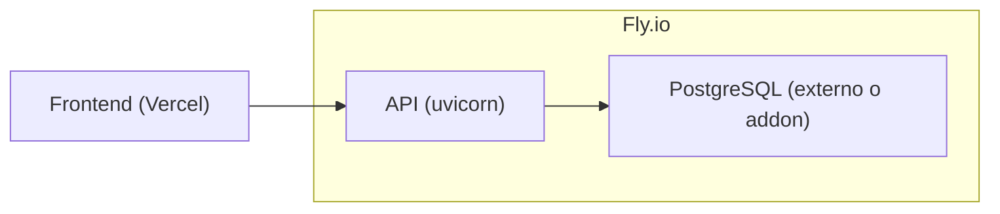
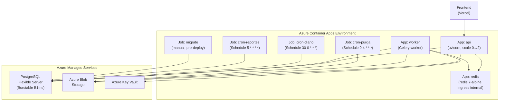

# Plan de Migración: Fly.io → Microsoft Azure

**Proyecto Acredittia · Cuenta Azure for Students ($100 USD/crédito)**
**Fecha:** 25 de septiembre 2026

---

## 0. Resumen Ejecutivo

Migrar los 4 procesos del backend (API, Worker, Beat, Migrate) desde Fly.io a **Azure Container Apps** sobre un plan de **Consumo** (scale-to-zero), con **Azure Database for PostgreSQL Flexible Server** y **Redis auto-hospedado** como Container App interno. El código ya tiene adaptadores Azure listos para Storage, Key Vault y la configuración por variables de entorno — la migración es principalmente de **infraestructura**, no de código. El frontend se mantiene en **Vercel** sin cambios.

### Arquitectura Actual (Fly.io)



- 1 máquina compartida, 1 vCPU, 1 GB RAM
- Auto-stop/start, región `gru` (São Paulo)
- Sin worker Celery ni Redis en producción actual

### Arquitectura Objetivo (Azure)



---

## 1. Inventario de Componentes a Migrar

| Componente | Origen (Fly.io) | Destino (Azure) | Servicio Azure |
|---|---|---|---|
| **API** (FastAPI/uvicorn) | `fly.toml`, 1 máquina shared | Container App `acredittia-api` | Container Apps (Consumption) |
| **Worker** (Celery) | No desplegado aún | Container App `acredittia-worker` | Container Apps (Consumption) |
| **Beat** (Celery Beat) | No desplegado aún | 3 Container Apps Jobs con cron trigger | Container Apps Jobs |
| **Migración** (DDL) | Manual / no automatizado | Container Apps Job `acredittia-migrate` | Container Apps Jobs |
| **PostgreSQL** | Fly Postgres o externo | Azure DB for PostgreSQL Flexible | Burstable B1ms (1 vCPU, 2 GB) |
| **Redis** | No desplegado | Container App `acredittia-redis` (interno) | Container Apps (Consumption) |
| **Blob Storage** | `STORAGE_BACKEND=local` | Azure Blob Storage | StorageV2, LRS |
| **Key Vault** | `JWE_BACKEND=local` | Azure Key Vault | Standard |
| **Container Registry** | Fly.io registry | Azure Container Registry | Basic |
| **Frontend** | Vercel | **Se mantiene en Vercel** | — |

---

## 2. Estimación de Costos Mensuales (Cuenta Estudiante)

> [!IMPORTANT]
> La cuenta Azure for Students provee **$100 USD de crédito anual** sin tarjeta de crédito. El objetivo es mantenerse **bajo $20 USD/mes** para que el crédito dure al menos 5 meses de desarrollo.

| Servicio | Tier / SKU | Costo Estimado |
|---|---|---|
| Container Apps (API) | Consumption, scale 0→1, ~2h/día activo | ~$0–2 (dentro del free grant) |
| Container Apps (Worker) | Consumption, scale 0→1 | ~$0–1 |
| Container Apps (Redis) | Consumption, min 1, 0.25 vCPU / 0.5 GiB | incluido en el free grant (~$0–1) |
| Container Apps Jobs (crons) | Ejecución breve 1×/día + 1×/hora + 1×/día | ~$0 (segundos de cómputo) |
| PostgreSQL Flexible Server | **Burstable B1ms** (1 vCPU, 2 GB, 32 GB storage) | **~$13/mes** |
| Azure Blob Storage | LRS, hot, <1 GB | ~$0.02 |
| Azure Key Vault | Standard, pocas operaciones | ~$0.03 |
| Container Registry | Basic | ~$5/mes |
| Frontend (Vercel) | Free tier | $0 (fuera de Azure) |
| **Total estimado** | | **~$13–20/mes** |

> [!TIP]
> **Con este presupuesto el crédito de $100 alcanza para ~5-7 meses de desarrollo.**
> Si el presupuesto se ajusta, Redis puede eliminarse temporalmente usando `QUEUE_BACKEND=inproc` (APScheduler en proceso, ya soportado por el código), lo que baja el total a ~$13-18/mes.

---

## 3. Prerequisitos

### 3.1 Herramientas Locales

```bash
# Instalar Azure CLI
winget install Microsoft.AzureCLI

# Verificar instalación
az version

# Login con cuenta de estudiante
az login

# Verificar suscripción activa
az account show
```

### 3.2 Extensiones requeridas

```bash
az extension add --name containerapp --upgrade
az extension add --name rdbms-connect --upgrade
```

### 3.3 Variables que necesitas definir

```bash
# Definir estas variables antes de ejecutar los comandos
$RG          = "rg-acredittia"
$LOCATION    = "northcentralus"
$ENV_NAME    = "acredittia-env"
$ACR_NAME    = "acredittiaregistry"  # debe ser globalmente único
$PG_SERVER   = "acredittia-pg"
$PG_ADMIN    = "pgadmin"
$PG_PASSWORD = "<contraseña-segura-aquí>"
$STORAGE_ACC = "acredittiablobs"     # debe ser globalmente único
$KV_NAME     = "acredittia-kv"
```

---

## 4. Fases de Implementación

### Fase 1: Crear la infraestructura base (Día 1-2)

#### 4.1.0 Configurar alertas de presupuesto

> [!CAUTION]
> **Hacer esto ANTES de crear cualquier recurso.** Una vez que empiezas a provisionar servicios, el consumo comienza inmediatamente.

1. Ir al **Azure Education Hub** → **Overview** → verificar crédito disponible.
2. Ir a **Cost Management + Billing** → **Budgets** → **+ Add**:
   - **Budget amount:** $100
   - **Alert conditions:**
     - Alerta al **50%** ($50 gastados) — tipo: Actual
     - Alerta al **80%** ($80 gastados) — tipo: Actual
     - Alerta al **90%** ($90 gastados) — tipo: Forecasted
   - **Alert recipients:** tu correo universitario
3. Ir a **Cost Management** → **Cost analysis** → fijar vista "Daily costs" para monitoreo continuo.

#### 4.1.1 Resource Group

```bash
az group create --name $RG --location $LOCATION
```

#### 4.1.2 Azure Container Registry (ACR)

```bash
az acr create --resource-group $RG --name $ACR_NAME --sku Basic --admin-enabled true
```

#### 4.1.3 PostgreSQL Flexible Server

```bash
az postgres flexible-server create `
    --resource-group $RG `
    --name $PG_SERVER `
    --location $LOCATION `
    --admin-user $PG_ADMIN `
    --admin-password $PG_PASSWORD `
    --sku-name Standard_B1ms `
    --tier Burstable `
    --storage-size 32 `
    --version 16 `
    --yes
```

Crear la base de datos y configurar:

```bash
# Crear la base de datos
az postgres flexible-server db create `
    --resource-group $RG `
    --server-name $PG_SERVER `
    --database-name acredittia

# log_error_verbosity=terse (§4.8 del modelo: no vuelca JWE en logs)
az postgres flexible-server parameter set `
    --resource-group $RG `
    --server-name $PG_SERVER `
    --name log_error_verbosity `
    --value terse

# Permitir acceso desde Azure services
az postgres flexible-server firewall-rule create `
    --resource-group $RG `
    --name $PG_SERVER `
    --rule-name AllowAzureServices `
    --start-ip-address 0.0.0.0 `
    --end-ip-address 0.0.0.0
```

#### 4.1.4 Azure Blob Storage

```bash
az storage account create `
    --resource-group $RG `
    --name $STORAGE_ACC `
    --location $LOCATION `
    --sku Standard_LRS `
    --kind StorageV2

# Crear el contenedor de documentos
az storage container create `
    --account-name $STORAGE_ACC `
    --name docs `
    --auth-mode login
```

#### 4.1.5 Azure Key Vault

```bash
az keyvault create `
    --resource-group $RG `
    --name $KV_NAME `
    --location $LOCATION `
    --sku standard

# Crear la clave RSA para cifrado de credenciales de plataforma
az keyvault key create `
    --vault-name $KV_NAME `
    --name plataforma-cred `
    --kty RSA `
    --size 3072 `
    --ops wrapKey unwrapKey
```

---

### Fase 2: Container Apps Environment y build de la imagen (Día 2-3)

#### 4.2.1 Crear el Environment de Container Apps

```bash
az containerapp env create `
    --resource-group $RG `
    --name $ENV_NAME `
    --location $LOCATION
```

#### 4.2.2 Build y push de la imagen Docker

```bash
# Obtener credenciales del registry
$ACR_LOGIN = az acr show --name $ACR_NAME --query loginServer -o tsv
$ACR_USER  = az acr credential show --name $ACR_NAME --query username -o tsv
$ACR_PASS  = az acr credential show --name $ACR_NAME --query "passwords[0].value" -o tsv

# Login en el registry
az acr login --name $ACR_NAME

# Build y push (desde la raíz del proyecto)
docker build -t "${ACR_LOGIN}/acredittia-backend:v1" ./backend
docker push "${ACR_LOGIN}/acredittia-backend:v1"
```

> [!TIP]
> Alternativa sin Docker local — usar ACR Tasks para build en la nube:
> ```bash
> az acr build --registry $ACR_NAME --image acredittia-backend:v1 ./backend
> ```

#### 4.2.3 Obtener las cadenas de conexión

```bash
# PostgreSQL
$PG_HOST = az postgres flexible-server show --resource-group $RG --name $PG_SERVER --query fullyQualifiedDomainName -o tsv
$DATABASE_URL = "postgresql+psycopg://${PG_ADMIN}:${PG_PASSWORD}@${PG_HOST}:5432/acredittia?sslmode=require"

# Redis: tráfico interno del Environment, sin TLS ni auth
$REDIS_URL = "redis://acredittia-redis:6379/0"

# Key Vault URL
$KV_URL = az keyvault show --resource-group $RG --name $KV_NAME --query properties.vaultUri -o tsv
```

---

### Fase 3: Desplegar los Container Apps (Día 3-4)

#### 4.3.1 Redis (Container App interno — desplegar primero)

```bash
az containerapp create `
    --resource-group $RG `
    --name acredittia-redis `
    --environment $ENV_NAME `
    --image redis:7-alpine `
    --target-port 6379 `
    --ingress internal `
    --transport tcp `
    --min-replicas 1 `
    --max-replicas 1 `
    --cpu 0.25 `
    --memory 0.5Gi `
    --command "redis-server" "--save" "" "--appendonly" "no"
```

> [!NOTE]
> **Supuesto explícito:** Redis corre sin persistencia en volumen (flags `--save "" --appendonly no`, mismo que el [docker-compose.yml](file:///c:/Users/Cristobal/Downloads/Universidad/GPI/Proyecto%20Acredittia/Acredittia-/docker-compose.yml#L27)). Si la Container App se reinicia, la cola Celery se pierde y las tareas en vuelo se reencolan al siguiente intento. Esto es aceptable para el entorno de desarrollo/staging de una cuenta de estudiante: las tareas son idempotentes y el cron diario las reintenta.

#### 4.3.2 Job de migración (ejecutar antes de la API)

```bash
az containerapp job create `
    --resource-group $RG `
    --name acredittia-migrate `
    --environment $ENV_NAME `
    --image "${ACR_LOGIN}/acredittia-backend:v1" `
    --registry-server $ACR_LOGIN `
    --registry-username $ACR_USER `
    --registry-password $ACR_PASS `
    --trigger-type Manual `
    --parallelism 1 `
    --replica-completions 1 `
    --replica-timeout 300 `
    --cpu 0.25 `
    --memory 0.5Gi `
    --command "python" "-m" "migrate.run" `
    --secrets "db-url=$DATABASE_URL" `
    --env-vars `
        "DATABASE_URL=secretref:db-url" `
        "SCHEMA_DIR=/schema"

# Ejecutar el job de migración
az containerapp job start --resource-group $RG --name acredittia-migrate
```

> [!WARNING]
> El job de migración usa el rol administrador para aplicar DDL. En producción real, usar `MIGRATE_DATABASE_URL` con un rol `acredittia_owner` dedicado. Para la cuenta de estudiante, el admin de PostgreSQL es suficiente.

#### 4.3.3 API (Container App principal)

```bash
az containerapp create `
    --resource-group $RG `
    --name acredittia-api `
    --environment $ENV_NAME `
    --image "${ACR_LOGIN}/acredittia-backend:v1" `
    --registry-server $ACR_LOGIN `
    --registry-username $ACR_USER `
    --registry-password $ACR_PASS `
    --target-port 8000 `
    --ingress external `
    --min-replicas 0 `
    --max-replicas 2 `
    --cpu 0.5 `
    --memory 1Gi `
    --secrets `
        "db-url=$DATABASE_URL" `
        "jwt-secret=<tu-jwt-secret-seguro>" `
    --env-vars `
        "DATABASE_URL=secretref:db-url" `
        "SCHEMA_DIR=/schema" `
        "DB_RLS_ENABLED=true" `
        "JWT_SECRET=secretref:jwt-secret" `
        "CORS_ORIGINS=https://acredittia.vercel.app" `
        "PUBLIC_BASE_URL=https://acredittia-api.<region>.azurecontainerapps.io" `
        "STORAGE_BACKEND=azure" `
        "AZURE_STORAGE_ACCOUNT=$STORAGE_ACC" `
        "AZURE_BLOB_CONTAINER=docs" `
        "QUEUE_BACKEND=celery" `
        "REDIS_URL=redis://acredittia-redis:6379/0" `
        "JWE_BACKEND=keyvault" `
        "AZURE_KEYVAULT_URL=$KV_URL" `
        "IA_BACKEND=simulada"
```

> [!NOTE]
> Después de crear la Container App, obtén su FQDN:
> ```bash
> $API_FQDN = az containerapp show --resource-group $RG --name acredittia-api --query properties.configuration.ingress.fqdn -o tsv
> echo "API URL: https://$API_FQDN"
> ```
> Luego actualiza `CORS_ORIGINS` y `PUBLIC_BASE_URL` con el FQDN real.

#### 4.3.4 Worker (Celery)

```bash
az containerapp create `
    --resource-group $RG `
    --name acredittia-worker `
    --environment $ENV_NAME `
    --image "${ACR_LOGIN}/acredittia-backend:v1" `
    --registry-server $ACR_LOGIN `
    --registry-username $ACR_USER `
    --registry-password $ACR_PASS `
    --min-replicas 0 `
    --max-replicas 2 `
    --cpu 0.5 `
    --memory 1Gi `
    --command "celery" "-A" "worker.celery_app" "worker" "--loglevel=info" "--concurrency=2" `
    --secrets `
        "db-url=$DATABASE_URL" `
    --env-vars `
        "DATABASE_URL=secretref:db-url" `
        "SCHEMA_DIR=/schema" `
        "QUEUE_BACKEND=celery" `
        "REDIS_URL=redis://acredittia-redis:6379/0" `
        "STORAGE_BACKEND=azure" `
        "AZURE_STORAGE_ACCOUNT=$STORAGE_ACC" `
        "AZURE_BLOB_CONTAINER=docs" `
        "JWE_BACKEND=keyvault" `
        "AZURE_KEYVAULT_URL=$KV_URL" `
        "IA_BACKEND=simulada"
```

#### 4.3.5 Jobs con cron trigger (reemplazan a Celery Beat)

En lugar de un proceso `celery beat` siempre activo, los tres crons del proyecto se implementan como **Container Apps Jobs con schedule trigger**. Cada job invoca directamente la función Python correspondiente sin pasar por el broker:

**Job 1: Cron diario** (recalcular vencimientos, snapshots, credenciales expiradas)

```bash
az containerapp job create `
    --resource-group $RG `
    --name acredittia-cron-diario `
    --environment $ENV_NAME `
    --image "${ACR_LOGIN}/acredittia-backend:v1" `
    --registry-server $ACR_LOGIN `
    --registry-username $ACR_USER `
    --registry-password $ACR_PASS `
    --trigger-type Schedule `
    --cron-expression "30 0 * * *" `
    --parallelism 1 `
    --replica-completions 1 `
    --replica-timeout 300 `
    --cpu 0.25 `
    --memory 0.5Gi `
    --command "python" "-c" "from worker.celery_app import cron_diario; cron_diario()" `
    --secrets "db-url=$DATABASE_URL" `
    --env-vars `
        "DATABASE_URL=secretref:db-url" `
        "QUEUE_BACKEND=celery" `
        "REDIS_URL=redis://acredittia-redis:6379/0"
```

**Job 2: Reportes programados** (cada hora, al minuto 5)

```bash
az containerapp job create `
    --resource-group $RG `
    --name acredittia-cron-reportes `
    --environment $ENV_NAME `
    --image "${ACR_LOGIN}/acredittia-backend:v1" `
    --registry-server $ACR_LOGIN `
    --registry-username $ACR_USER `
    --registry-password $ACR_PASS `
    --trigger-type Schedule `
    --cron-expression "5 * * * *" `
    --parallelism 1 `
    --replica-completions 1 `
    --replica-timeout 300 `
    --cpu 0.25 `
    --memory 0.5Gi `
    --command "python" "-c" "from worker.celery_app import cron_reportes_programados; cron_reportes_programados()" `
    --secrets "db-url=$DATABASE_URL" `
    --env-vars `
        "DATABASE_URL=secretref:db-url" `
        "QUEUE_BACKEND=celery" `
        "REDIS_URL=redis://acredittia-redis:6379/0"
```

**Job 3: Purga de temporales** (diario a las 4:00)

```bash
az containerapp job create `
    --resource-group $RG `
    --name acredittia-cron-purga `
    --environment $ENV_NAME `
    --image "${ACR_LOGIN}/acredittia-backend:v1" `
    --registry-server $ACR_LOGIN `
    --registry-username $ACR_USER `
    --registry-password $ACR_PASS `
    --trigger-type Schedule `
    --cron-expression "0 4 * * *" `
    --parallelism 1 `
    --replica-completions 1 `
    --replica-timeout 300 `
    --cpu 0.25 `
    --memory 0.5Gi `
    --command "python" "-c" "from worker.celery_app import cron_purga_temporales; cron_purga_temporales()" `
    --secrets "db-url=$DATABASE_URL" `
    --env-vars `
        "DATABASE_URL=secretref:db-url" `
        "QUEUE_BACKEND=celery" `
        "REDIS_URL=redis://acredittia-redis:6379/0" `
        "STORAGE_BACKEND=azure" `
        "AZURE_STORAGE_ACCOUNT=$STORAGE_ACC" `
        "AZURE_BLOB_CONTAINER=docs"
```

> [!NOTE]
> Los tres crons corresponden exactamente al `beat_schedule` definido en [celery_app.py](file:///c:/Users/Cristobal/Downloads/Universidad/GPI/Proyecto%20Acredittia/Acredittia-/backend/worker/celery_app.py#L116-L129). Cada función (`cron_diario`, `cron_reportes_programados`, `cron_purga_temporales`) es un `@celery.task` callable directamente como función Python; se ejecuta en el proceso del Job sin necesidad de un worker Celery intermediando.

---

### Fase 4: Identidad Administrada y permisos RBAC (Día 4)

#### 4.4.1 Habilitar System-Assigned Managed Identity

```bash
# En API
az containerapp identity assign `
    --resource-group $RG `
    --name acredittia-api `
    --system-assigned

# En Worker
az containerapp identity assign `
    --resource-group $RG `
    --name acredittia-worker `
    --system-assigned

# En Job cron-purga
az containerapp job identity assign `
    --resource-group $RG `
    --name acredittia-cron-purga `
    --system-assigned
```

#### 4.4.2 Asignar roles RBAC

```bash
# Obtener los Principal IDs
$API_PRINCIPAL = az containerapp identity show --resource-group $RG --name acredittia-api --query principalId -o tsv
$WRK_PRINCIPAL = az containerapp identity show --resource-group $RG --name acredittia-worker --query principalId -o tsv
$PURGA_PRINCIPAL = az containerapp job identity show --resource-group $RG --name acredittia-cron-purga --query principalId -o tsv

# Storage Blob Data Contributor (para SAS de usuario delegado)
$STORAGE_ID = az storage account show --resource-group $RG --name $STORAGE_ACC --query id -o tsv
az role assignment create --assignee $API_PRINCIPAL --role "Storage Blob Data Contributor" --scope $STORAGE_ID
az role assignment create --assignee $WRK_PRINCIPAL --role "Storage Blob Data Contributor" --scope $STORAGE_ID
az role assignment create --assignee $PURGA_PRINCIPAL --role "Storage Blob Data Contributor" --scope $STORAGE_ID

# Key Vault Crypto User (para wrapKey/unwrapKey)
$KV_ID = az keyvault show --resource-group $RG --name $KV_NAME --query id -o tsv
az role assignment create --assignee $API_PRINCIPAL --role "Key Vault Crypto User" --scope $KV_ID
az role assignment create --assignee $WRK_PRINCIPAL --role "Key Vault Crypto User" --scope $KV_ID
```

> [!NOTE]
> **¿Por qué la API también necesita Key Vault Crypto User?**
> Verificado en el código: la API invoca `cifrar_credencial()` → `get_wrapper().wrap(cek)` desde [plataformas.py:573](file:///c:/Users/Cristobal/Downloads/Universidad/GPI/Proyecto%20Acredittia/Acredittia-/backend/app/routers/plataformas.py#L573) al guardar credenciales de plataforma. El Worker invoca `descifrar_credencial()` → `get_wrapper().unwrap()` desde [integraciones.py:428](file:///c:/Users/Cristobal/Downloads/Universidad/GPI/Proyecto%20Acredittia/Acredittia-/backend/app/services/integraciones.py#L428) al leer credenciales para sincronización. Ambos necesitan `wrapKey`/`unwrapKey` sobre la clave `plataforma-cred` en Key Vault.

> [!IMPORTANT]
> Después de asignar la identidad administrada, puedes quitar `AZURE_BLOB_CONN` de las variables de entorno y usar solo `AZURE_STORAGE_ACCOUNT`. El código en [storage.py](file:///c:/Users/Cristobal/Downloads/Universidad/GPI/Proyecto%20Acredittia/Acredittia-/backend/app/services/storage.py) ya prioriza `DefaultAzureCredential` sobre la cadena de conexión.

---

### Fase 5: Configuración de Frontend en Vercel

El frontend **no se migra a Azure**; permanece en Vercel (free tier).

#### 5.1 Variable de entorno en Vercel

En el dashboard de Vercel → proyecto Acredittia → **Settings** → **Environment Variables**:

| Variable | Valor |
|---|---|
| `NEXT_PUBLIC_API_URL` | `https://<api-fqdn>` (el FQDN de `acredittia-api`) |

#### 5.2 CORS en la API

Actualizar `CORS_ORIGINS` en la Container App de la API para incluir el dominio real de Vercel:

```bash
az containerapp update `
    --resource-group $RG `
    --name acredittia-api `
    --set-env-vars "CORS_ORIGINS=https://acredittia.vercel.app"
```

(Reemplaza `acredittia.vercel.app` con el dominio real asignado por Vercel.)

#### 5.3 Cookies cross-site (validación obligatoria)

> [!WARNING]
> Como frontend (Vercel) y backend (Azure) quedan en **dominios distintos**, cualquier cookie de sesión httpOnly pasa a ser **cross-site**. Verificar/ajustar lo siguiente ANTES de dar la migración por buena:
>
> 1. **Cookie de sesión/refresh token**: debe tener `SameSite=None; Secure` (sin esto, los navegadores la bloquean en requests cross-origin).
> 2. **Frontend (fetch)**: todas las llamadas a la API deben usar `credentials: "include"` para que el navegador envíe la cookie.
> 3. **Backend (CORS)**: la API ya responde `Access-Control-Allow-Credentials: true` (configurado en [main.py:79](file:///c:/Users/Cristobal/Downloads/Universidad/GPI/Proyecto%20Acredittia/Acredittia-/backend/app/main.py#L79) con `allow_credentials=True`), pero verificar que `Access-Control-Allow-Origin` **no** sea `*` (debe ser el dominio exacto de Vercel cuando `Allow-Credentials` es `true`).
>
> **Paso de validación obligatorio:** realizar un login real contra la API desplegada en Azure desde el frontend en Vercel. Verificar en DevTools → Network → la respuesta del endpoint de login incluye `Set-Cookie` con los atributos correctos, y las requests subsecuentes envían la cookie.

---

### Fase 6: Validación y health checks (Día 5)

#### 4.6.1 Configurar health probes

Las health probes ya están implementadas en [main.py](file:///c:/Users/Cristobal/Downloads/Universidad/GPI/Proyecto%20Acredittia/Acredittia-/backend/app/main.py#L156-L173):

```bash
az containerapp update `
    --resource-group $RG `
    --name acredittia-api `
    --set-env-vars "SCHEMA_VERSION_ESPERADA=6"
```

Container Apps usará automáticamente el `HEALTHCHECK` del [Dockerfile](file:///c:/Users/Cristobal/Downloads/Universidad/GPI/Proyecto%20Acredittia/Acredittia-/backend/Dockerfile#L28-L29) (`curl -fsS http://localhost:8000/health`).

#### 4.6.2 Checklist de validación

- [ ] `GET https://<api-fqdn>/health` → `{"status": "ok", "version": "1.1.0"}`
- [ ] `GET https://<api-fqdn>/health/esquema` → `{"status": "ok", "schema_version": 6}`
- [ ] `POST https://<api-fqdn>/api/v1/auth/login` con credenciales semilla → token JWT válido
- [ ] Frontend en Vercel carga y puede autenticarse contra la API (validar cookies cross-site, ver §5.3)
- [ ] Subida de archivo funciona vía SAS de Azure Blob
- [ ] Worker procesa tareas desde la cola Redis interna
- [ ] `az containerapp job execution list --resource-group $RG --name acredittia-cron-diario` muestra una ejecución exitosa reciente

---

## 5. Cambios en el Código

> [!NOTE]
> El código **ya está preparado para Azure** gracias al sistema de adaptadores por variable de entorno en [config.py](file:///c:/Users/Cristobal/Downloads/Universidad/GPI/Proyecto%20Acredittia/Acredittia-/backend/app/config.py). Los cambios necesarios son mínimos.

### 5.1 Cambios requeridos

| Archivo | Cambio | Razón |
|---|---|---|
| [fly.toml](file:///c:/Users/Cristobal/Downloads/Universidad/GPI/Proyecto%20Acredittia/Acredittia-/backend/fly.toml) | **Eliminar** o mover a `.archive/` | Ya no se usa Fly.io |
| [docker-compose.yml](file:///c:/Users/Cristobal/Downloads/Universidad/GPI/Proyecto%20Acredittia/Acredittia-/docker-compose.yml) | **Mantener** (solo desarrollo local) | Sin cambios; sigue siendo el entorno de desarrollo |
| [Dockerfile](file:///c:/Users/Cristobal/Downloads/Universidad/GPI/Proyecto%20Acredittia/Acredittia-/backend/Dockerfile) | **Sin cambios** | Ya incluye `curl` para probes, usuario sin privilegios, y multi-proceso |

### 5.2 Cambios opcionales (recomendados)

| Archivo | Cambio | Razón |
|---|---|---|
| `backend/.env.azure.template` | **Crear** — template con todas las variables Azure | Documentar la configuración de producción |
| [README.md](file:///c:/Users/Cristobal/Downloads/Universidad/GPI/Proyecto%20Acredittia/Acredittia-/README.md) | Agregar sección "Despliegue en Azure" | Documentar el proceso |

### 5.3 Lo que NO necesita cambiar

El código ya soporta Azure de forma nativa gracias a:

- **Storage**: [storage.py](file:///c:/Users/Cristobal/Downloads/Universidad/GPI/Proyecto%20Acredittia/Acredittia-/backend/app/services/storage.py) → `STORAGE_BACKEND=azure` activa `AzureBlobStorage` con SAS delegado
- **Key Vault**: [crypto.py](file:///c:/Users/Cristobal/Downloads/Universidad/GPI/Proyecto%20Acredittia/Acredittia-/backend/app/services/crypto.py) → `JWE_BACKEND=keyvault` activa `AzureKeyVaultWrapper`
- **Cola**: [celery_app.py](file:///c:/Users/Cristobal/Downloads/Universidad/GPI/Proyecto%20Acredittia/Acredittia-/backend/worker/celery_app.py) → `QUEUE_BACKEND=celery` con `REDIS_URL` apunta al Redis interno
- **Migración**: [run.py](file:///c:/Users/Cristobal/Downloads/Universidad/GPI/Proyecto%20Acredittia/Acredittia-/backend/migrate/run.py) → funciona como Container Apps Job sin modificaciones

---

## 6. Pipeline CI/CD (GitHub Actions)

### 6.1 Configurar autenticación federada (OIDC)

En vez de un secreto de larga duración, se usa una **federated credential** que confía en el token OIDC de GitHub Actions:

```bash
# 1. Crear una App Registration
$APP_ID = az ad app create --display-name "acredittia-cicd" --query appId -o tsv

# 2. Crear el Service Principal asociado
az ad sp create --id $APP_ID

# 3. Asignar rol Contributor sobre el Resource Group
$SUB_ID = az account show --query id -o tsv
az role assignment create `
    --assignee $APP_ID `
    --role Contributor `
    --scope "/subscriptions/${SUB_ID}/resourceGroups/${RG}"

# 4. Asignar rol AcrPush sobre el Container Registry
$ACR_ID = az acr show --name $ACR_NAME --query id -o tsv
az role assignment create `
    --assignee $APP_ID `
    --role AcrPush `
    --scope $ACR_ID

# 5. Crear la federated credential para GitHub Actions
$TENANT_ID = az account show --query tenantId -o tsv

az ad app federated-credential create --id $APP_ID --parameters '{
  "name": "github-deploy-main",
  "issuer": "https://token.actions.githubusercontent.com",
  "subject": "repo:<owner>/Acredittia-:ref:refs/heads/main",
  "audiences": ["api://AzureADTokenExchange"],
  "description": "Deploy desde GitHub Actions en rama main"
}'
```

> [!IMPORTANT]
> Reemplaza `<owner>` con el usuario u organización de GitHub que posee el repositorio.

Luego, en **GitHub → Settings → Secrets and variables → Actions**, crear estos **secretos de repositorio**:

| Secreto | Valor |
|---|---|
| `AZURE_CLIENT_ID` | `$APP_ID` (el appId de la App Registration) |
| `AZURE_TENANT_ID` | `$TENANT_ID` |
| `AZURE_SUBSCRIPTION_ID` | `$SUB_ID` |

### 6.2 Archivo `.github/workflows/deploy-azure.yml`

```yaml
name: Deploy Backend to Azure

on:
  push:
    branches: [main]
    paths: ['backend/**']

permissions:
  id-token: write
  contents: read

env:
  ACR_NAME: acredittiaregistry
  RG: rg-acredittia
  IMAGE: acredittia-backend

jobs:
  build-and-deploy:
    runs-on: ubuntu-latest
    steps:
      - uses: actions/checkout@v4

      - name: Set up Python
        uses: actions/setup-python@v5
        with:
          python-version: '3.12'

      - name: Install dependencies
        run: pip install -r backend/requirements.txt

      - name: Run tests
        run: pytest backend/
        # Si pytest falla, el job se detiene aquí (comportamiento default)

      - name: Login to Azure (OIDC)
        uses: azure/login@v2
        with:
          client-id: ${{ secrets.AZURE_CLIENT_ID }}
          tenant-id: ${{ secrets.AZURE_TENANT_ID }}
          subscription-id: ${{ secrets.AZURE_SUBSCRIPTION_ID }}

      - name: Login to ACR
        run: az acr login --name ${{ env.ACR_NAME }}

      - name: Build & Push
        run: |
          TAG=${{ github.sha }}
          az acr build --registry ${{ env.ACR_NAME }} \
            --image ${{ env.IMAGE }}:$TAG \
            --image ${{ env.IMAGE }}:latest \
            ./backend

      - name: Run Migration Job
        run: |
          az containerapp job start \
            --resource-group ${{ env.RG }} \
            --name acredittia-migrate \
            --image ${{ env.ACR_NAME }}.azurecr.io/${{ env.IMAGE }}:${{ github.sha }}

      - name: Deploy API
        run: |
          az containerapp update \
            --resource-group ${{ env.RG }} \
            --name acredittia-api \
            --image ${{ env.ACR_NAME }}.azurecr.io/${{ env.IMAGE }}:${{ github.sha }}

      - name: Deploy Worker
        run: |
          az containerapp update \
            --resource-group ${{ env.RG }} \
            --name acredittia-worker \
            --image ${{ env.ACR_NAME }}.azurecr.io/${{ env.IMAGE }}:${{ github.sha }}

      - name: Update Cron Jobs
        run: |
          for JOB in acredittia-cron-diario acredittia-cron-reportes acredittia-cron-purga; do
            az containerapp job update \
              --resource-group ${{ env.RG }} \
              --name $JOB \
              --image ${{ env.ACR_NAME }}.azurecr.io/${{ env.IMAGE }}:${{ github.sha }}
          done
```

---

## 7. Cronograma de Ejecución

| Día | Tarea | Duración | Dependencia |
|---|---|---|---|
| **Día 1** | Configurar alertas de presupuesto en Education Hub | 30 min | Cuenta Azure activa |
| **Día 1** | Crear Resource Group, ACR, PostgreSQL, Storage, Key Vault | 3-4 h | Alertas configuradas |
| **Día 2** | Crear Container Apps Environment, build imagen, push a ACR | 2-3 h | Día 1 |
| **Día 3** | Desplegar Redis interno + migrate job + API container app, probar `/health` | 3-4 h | Día 2 |
| **Día 3** | Desplegar Worker + cron jobs, configurar identidad administrada | 2-3 h | API funcionando |
| **Día 4** | Asignar RBAC, probar Storage y Key Vault con identidad administrada | 2-3 h | Día 3 |
| **Día 4** | Configurar Vercel (NEXT_PUBLIC_API_URL, CORS), validar cookies cross-site | 1-2 h | API con FQDN |
| **Día 5** | Validación E2E completa, configurar CI/CD con OIDC en GitHub Actions | 3-4 h | Todo desplegado |
| **Día 5** | Actualizar README, archivar `fly.toml`, documentar | 1 h | — |

**Total estimado: 5 días de trabajo**

---

## 8. Riesgos y Mitigaciones

| Riesgo | Probabilidad | Impacto | Mitigación |
|---|---|---|---|
| Crédito de $100 se agota antes de tiempo | Media | Alto | Alertas configuradas al 50%/80%/90%; usar scale-to-zero agresivo; apagar servicios fuera de horario de desarrollo |
| Cuota de región insuficiente en northcentralus | Baja | Medio | Si northcentralus no tiene cuota, intentar mexicocentral o canadacentral (permitidas por política) |
| PostgreSQL Flexible Server no disponible en student tier | Baja | Alto | Alternativa: usar PostgreSQL en un Container App (imagen Docker), aunque pierde backups automáticos |
| Cold start de Container Apps demasiado lento | Media | Bajo | Configurar `min_replicas: 1` para la API si es problema (aumenta costo) |
| Cookies cross-site bloqueadas por navegador | Media | Alto | Validar SameSite=None + Secure ANTES de marcar la migración como completa (§5.3) |
| Redis Container App se reinicia y pierde la cola | Baja | Bajo | Tareas son idempotentes; el cron diario reintenta; aceptable para staging/desarrollo |

---

## 9. Comandos de Mantenimiento Post-Migración

```bash
# Ver logs de la API en tiempo real
az containerapp logs show --resource-group $RG --name acredittia-api --follow

# Ver logs del worker
az containerapp logs show --resource-group $RG --name acredittia-worker --follow

# Ver ejecuciones del cron diario
az containerapp job execution list --resource-group $RG --name acredittia-cron-diario -o table

# Ejecutar migración manualmente
az containerapp job start --resource-group $RG --name acredittia-migrate

# Ejecutar cron diario manualmente (fuera de horario)
az containerapp job start --resource-group $RG --name acredittia-cron-diario

# Escalar la API manualmente
az containerapp update --resource-group $RG --name acredittia-api --min-replicas 1 --max-replicas 3

# Ver consumo de crédito
az consumption usage list --subscription <id> --top 10

# Apagar todo (para ahorrar crédito fuera de horario)
az containerapp update --resource-group $RG --name acredittia-api --min-replicas 0 --max-replicas 0
az containerapp update --resource-group $RG --name acredittia-worker --min-replicas 0 --max-replicas 0
# Redis se puede dejar corriendo (costo mínimo dentro del free grant)
```

---

## 10. Checklist Final de Migración

- [ ] **Presupuesto**: Alertas de gasto configuradas al 50%, 80% y 90% en Education Hub
- [ ] **Infraestructura**: Resource Group, ACR, PostgreSQL, Storage, Key Vault creados
- [ ] **Imagen**: Backend Docker construido y publicado en ACR
- [ ] **Redis**: Container App interno funcionando (`acredittia-redis:6379`)
- [ ] **Migración**: Job ejecutado, esquema v6 verificado
- [ ] **API**: Container App funcionando, `/health` responde 200
- [ ] **Worker**: Container App funcionando, procesando tareas desde Redis interno
- [ ] **Cron diario**: `az containerapp job execution list --name acredittia-cron-diario` muestra ejecución exitosa
- [ ] **Cron reportes**: Job configurado con `5 * * * *`
- [ ] **Cron purga**: Job configurado con `0 4 * * *`
- [ ] **RBAC**: Identidad administrada con roles en Storage y Key Vault (API + Worker)
- [ ] **RBAC de cron-purga**: identidad asignada y rol Storage Blob Data Contributor confirmado
- [ ] **Vercel**: `NEXT_PUBLIC_API_URL` apuntando al FQDN de la API
- [ ] **CORS**: `CORS_ORIGINS` configurado con el dominio real de Vercel
- [ ] **Cookies cross-site**: Login real validado desde Vercel → Azure (SameSite=None; Secure)
- [ ] **CI/CD**: GitHub Actions con OIDC (federated credential) + gate de pytest
- [ ] **DNS**: (Opcional) Dominio personalizado configurado
- [ ] **Documentación**: README actualizado, `fly.toml` archivado
- [ ] **Fly.io**: App original eliminada o detenida
